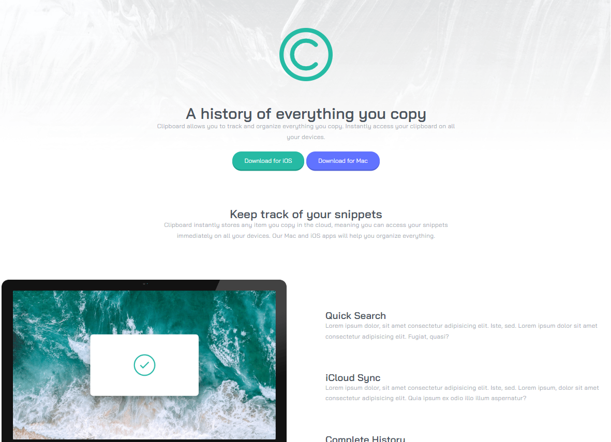

# Frontend Mentor - Clipboard Landing Page Solution

This is a solution to the [Clipboard Landing Page challenge on Frontend Mentor](https://www.frontendmentor.io/challenges/clipboard-landing-page-5cc9bccd6c4c91111378ecb9). Frontend Mentor challenges help you improve your coding skills by building realistic projects.

## Table of contents

- [Frontend Mentor - Clipboard Landing Page Solution](#frontend-mentor---clipboard-landing-page-solution)
  - [Table of contents](#table-of-contents)
  - [Overview](#overview)
    - [The challenge](#the-challenge)
    - [Links](#links)
  - [My process](#my-process)
    - [Built with](#built-with)
  - [Author](#author)

## Overview

### The challenge

Users should be able to:

- View the optimal layout depending on their device's screen size
- See hover states for interactive elements

### Links

- [Solution ](https://crolette.github.io/clipboard-landing-page/)

## My process

### Built with

- Semantic HTML5 markup
- SCSS (mixin, variables, partials)
- Flexbox
- Grid
- Desktop-first workflow

## Author

- [Website](https://www.crolweb.be)
- [Frontend Mentor](https://www.frontendmentor.io/profile/crolette)
- [Github](https://github.com/crolette)
- [Linkedin](https://www.linkedin.com/in/jonathan-de-dijcker/)
